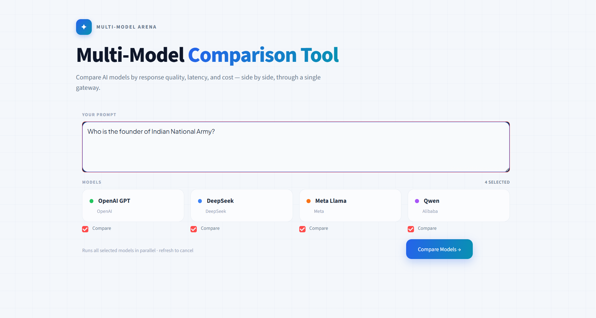
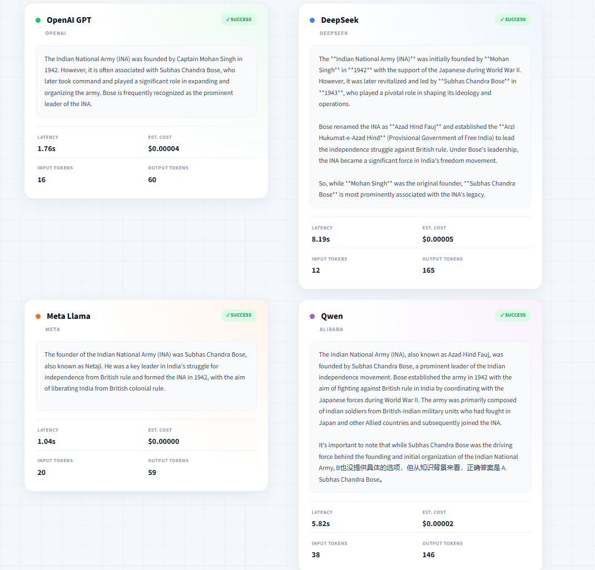

<div align="center">

# 🔭 Multi-Model Comparison Tool

### Ask one question. Compare four AI models side by side — by answer, speed, and cost.

[](https://www.python.org/)
[](https://streamlit.io/)
[](https://openrouter.ai/)
[](LICENSE)

*A single OpenRouter key. One question. Four models. Honest, side-by-side answers.*

</div>

---

## 💡 Why this exists

> *"Which model should I use?"* can't be answered by a leaderboard — it depends on **your** task, **your** budget, and **your** latency needs.

The only honest way to decide is to ask the **same question** to several models and compare their **answers, speed, and cost**. Wiring up four separate provider SDKs and four accounts is slow and wasteful — so this tool routes all four through a **single OpenRouter gateway**.

---

## ✨ Features

| | Feature |
|---|---|
| 🔑 | **One key, one endpoint** — all models through OpenRouter |
| ⚡ | **Latency measured** per call, in seconds |
| 💰 | **Cost computed** per call from real token usage |
| 🛡️ | **Independent error handling** — one model failing never stops the others |
| 🖥️ | **Two front-ends** — a clean terminal app *and* a polished Streamlit web UI |
| 🎨 | **Colour-coded cards** — each model gets its own accent for instant scanning |
| 🔒 | **Secrets stay secret** — the API key lives only in `.env`, never in git |

---

## 🤖 Models compared

| Model | Provider | Accent |
|---|---|:---:|
| `openai/gpt-4o-mini` | OpenAI | 🟢 |
| `deepseek/deepseek-chat` | DeepSeek | 🔵 |
| `meta-llama/llama-3.1-8b-instruct` | Meta | 🟠 |
| `qwen/qwen-2.5-7b-instruct` | Alibaba | 🟣 |

> Swap models or prices anytime in [`main.py`](main.py).

---

## 📸 Screenshots

### Ask a question
<div align="center">
  
</div>

### Compare the results
<div align="center">
  
</div>

---

## 🚀 Quick start

```bash
# 1. Clone the repo
git clone https://github.com/akshayaregidi07-source/MultiModel-App.git
cd MultiModel-App

# 2. Create & activate a virtual environment
python -m venv .venv
.venv\Scripts\activate          # Windows
# source .venv/bin/activate     # macOS / Linux

# 3. Install dependencies
pip install -r requirements.txt

# 4. Add your OpenRouter key
#    Create a file named .env with this line:
#    OPENROUTER_API_KEY=sk-or-...your-key...
```

> 🔑 Get a free key at **[openrouter.ai/keys](https://openrouter.ai/settings/keys)**.

---

## ▶️ Run it

**Terminal version** — quick and scriptable:

```bash
python main.py
```

**Web version** — the full Streamlit interface:

```bash
python -m streamlit run app.py
```

Then open **http://localhost:8501** in your browser.

---

## 📊 What you get per model

- **Answer** — the response text
- **Latency** — how long the call took (seconds)
- **Tokens** — input & output token counts
- **Cost** — estimated USD from published per-token prices

---

## 🗂️ Project structure

```
MultiModel-App/
├─ spec.md            ← the specification, written first
├─ main.py            ← terminal app + the shared ask() engine
├─ app.py             ← Streamlit web interface
├─ requirements.txt   ← dependencies
├─ .env               ← your API key  (never committed)
├─ .gitignore         ← keeps .env & caches out of git
└─ assets/            ← screenshots for this README
```

| File | Purpose |
|---|---|
| `spec.md` | The plan and contract — written **before** any code |
| `main.py` | Terminal entry point + the reusable `ask()` function |
| `app.py` | Web UI; imports `ask()` so logic is never duplicated |
| `.env` | Holds the secret key, loaded at runtime |

---

## 🛡️ Error handling in action

Break one model name on purpose and the other three still answer — each call is isolated in its own `try / except`. In the web UI, a failed model shows a red **ERROR** card while its neighbours render normally.

---

## 🔐 A note on secrets

The API key lives **only** in `.env`, which is listed in [`.gitignore`](.gitignore) and never pushed to GitHub. Treat your key like a password:

> *A key committed to git is a key you must cancel — anyone who sees the repo can spend your credits.*

---

## 🧭 Roadmap / stretch goals

- [ ] Sort results by cost or latency
- [ ] Read the model list from a config file
- [ ] Save each run to `results.csv`
- [ ] Add a 1–5 quality rating and see whether it tracks price

---

<div align="center">

Built as part of **GenAI & Agentic AI Engineering** · Day 2

*Engineered, not hacked together — a clear spec, a clean repo, and no leaked secrets.*

</div>
